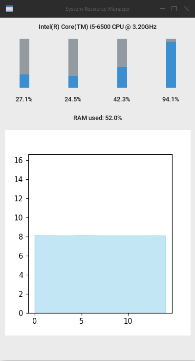

# System Monitor

A live CPU and RAM monitoring tool with a clean graphical interface.



## Features

- Live per‑core CPU usage bars with percentages
- RAM usage percentage and live scrolling chart (GB used)
- Real‑time updates every 0.5 seconds
- Clean, minimal interface using CustomTkinter
- Built with Python, psutil, and matplotlib

## Installation

```bash
# Clone the repository
git clone https://github.com/jcat-github/SystemMonitorUI
cd SystemMonitorUI

# Run the Python script
python main.py
